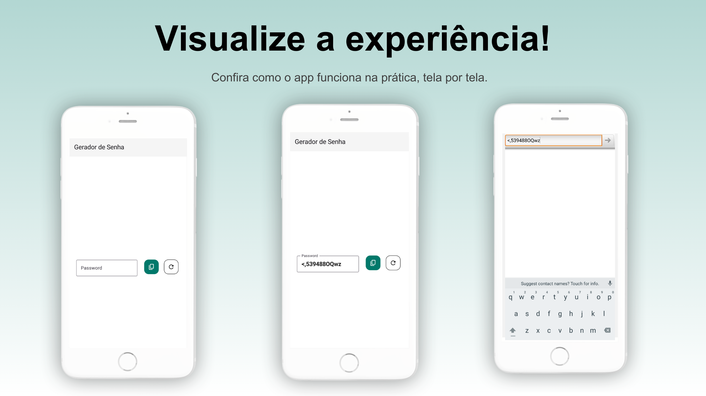

# 🔐 Gerador de Senhas

Aplicativo Android simples e funcional para geração de senhas seguras. Criado com **Jetpack Compose** como parte dos meus estudos no curso **Jetpack Compose do Zero ao Avançado**, oferecido pela [Stack Mobile](https://stackmobile.com.br/).

---

## ✨ Funcionalidades

- 🔁 Geração automática de senhas seguras
- 🔡 Mistura de letras maiúsculas, minúsculas, números e símbolos
- 📋 Copiar senha com um toque
- 🎨 Interface responsiva e moderna com Material 3

---

## 📸 Imagens do App

> As imagens abaixo foram montadas com o template gratuito **[Creta – Slidecore](https://slidecoretemplates.com/pt-pt/producto/creta-modelo-de-apresentacao-de-aplicativo-gratuito/#google_vignette)**.

<!-- Adicione aqui as imagens de apresentação -->

---

## 🎥 Vídeo Demonstrativo

<!-- Adicione aqui o link do vídeo ou gif da execução do app -->

---

## 📱 Tecnologias Utilizadas

- [x] Kotlin
- [x] Jetpack Compose
- [x] Material 3
- [x] Android Studio
- [x] ClipboardManager

---

## 📚 Sobre o Projeto

Esse projeto foi desenvolvido como prática do curso:

**Jetpack Compose do Zero ao Avançado**  
📚 Por: Stack Mobile  
🎓 Plataforma: Udemy

Me ajudou a consolidar os seguintes aprendizados:

- Composição de layout com `Row`, `Column` e `Modifier`
- Gerenciamento de estado com `remember` e `mutableStateOf`
- Utilização de `IconButton`, `OutlinedTextField` e `Scaffold`
- Integração com a área de transferência (ClipboardManager)

---

## 🙌 Créditos

- Template de apresentação de imagens:  
  [Creta – Slidecore](https://slidecoretemplates.com/pt-pt/producto/creta-modelo-de-apresentacao-de-aplicativo-gratuito/#google_vignette)
- Curso base:  
  [Jetpack Compose do Zero ao Avançado – Stack Mobile](https://stackmobile.com.br/)
